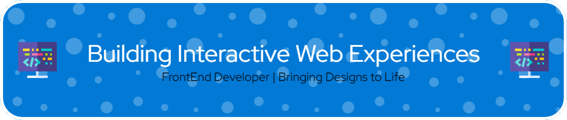

#      Hi 👋, I'm Christian J. Amaguaña

  

  

- 🌱 I’m currently learning **C#, React Native and Kotlin for Developer Mobile**

- 💬 Ask me about **React, PERN and MERN**

- 📫 How to reach me **christianj.amaguana@gmail.com**

- ⚡ Fun fact **I am a very proactive person, eager to learn and improve significantly in all my skills as a developer**

<h3 align="left">Connect with me:</h3>

<h3 align="left">Languages and Tools:</h3>

